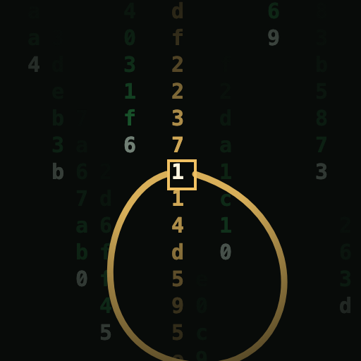
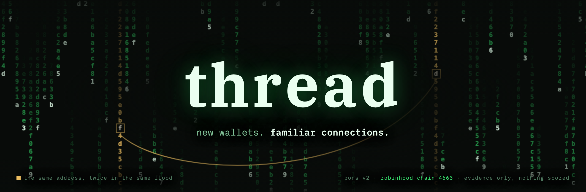

<p align="center">
  
</p>
<p align="center">
  
</p>

<p align="center">
  
  
  
  
  
  
  
  
</p>

---

A launch on Pons v2 is judged in isolation: this curve, this tax, this deployer, right now. Nothing about
it remembers the *last* launch by the same actors — even though two facts already sit inside the protocol's
own contracts, unused as history: the fee escrow's `Credited`/`Claimed` events name who actually gets paid
on a token, launch after launch, and the launch factory names who deployed it, and whether that address has
graduated anything before. Neither fact requires guessing at wallet ownership across the wider chain. Both
are native to Pons v2, and both compound: the tenth launch by an address thread has already seen is a fact,
not an inference.

That's the pitch. Here's the honest state of it: **deployer history is real and live. Fee-recipient history
is not.** The first thing the real version found was a way it could have lied — read on before the table.

| The problem | What's actually true right now | Where |
|---|---|---|
| "what is this contract" | live `name`/`symbol`/`decimals`/`totalSupply`, proxy-clone detection, one RPC round trip | `lookup/index.html` — **works today** |
| "who else has this deployer launched" | live query against Bitquery's real launch log, with known shared infrastructure (Multicall3) flagged instead of counted as a person | `scripts/deployer-history.js` — **works today** |
| "who else got paid the same creator fee" | `TokenLaunched` doesn't carry this data at all — it's in decoded call input, not built yet | `SPEC.md` M3 — **not built** |
| "what would the finished, assembled case file look like" | a mockup against three made-up tokens, clearly marked fictional | `demo/index.html` — **fixture data** |
| "are the three example addresses in `lookup/index.html` and the mockup real Pons v2 launches" | checked directly against the factory, router, hook and locker logs — **no match in any of them** | `STATUS.md` M0.5 |

That last row matters more than it looks. The three addresses baked into both pages above resolve to real,
live ERC-20 contracts on Robinhood Chain — but none of them show up in `TokenLaunched` events from the known
`PonsV2LaunchFactory`, or in the router, the meme hook, or the locker. They may predate that factory, use a
factory address not on record here, or simply not be Pons v2 launches at all. Worth flagging as a fact, not
an accusation, the way [RULES.md](RULES.md) asks for: one of the three is named "Pons"/"PONS" itself — the
same name as the launchpad — and that's a fact about its `symbol()` call, not evidence of who deployed it or
why.

## Install

Node 18 or newer. No build step, no framework, and nothing to install beyond the repository itself — the
dependency list is empty on purpose.

```sh
git clone https://github.com/dunik77/thread && cd thread
npm test                                  # 55 checks, offline, no key needed
```

That already runs the whole test suite and lets you open `lookup/index.html` in a browser for live ERC-20
reads, which need no key at all. For deployer history you need a free Bitquery token:

```sh
# 1. get a token (free): https://account.bitquery.io/user/api_v2/access_tokens
cp .env.example .env
# 2. paste it in, so the file reads: BITQUERY_API_TOKEN=your_token_here

# 3. start the service
npm run serve                             # → http://localhost:4663
```

Then paste any Pons v2 token or deployer address into the page. The same lookup works from a terminal:

```sh
node scripts/deployer-history.js 0xca11bde05977b3631167028862be2a173976ca11
```

`.env` is gitignored and read only by the Node scripts. The Bitquery token never reaches a browser, on
purpose: a key embedded in a static page is a key anyone viewing source can take. That's also why the
key-free `lookup/index.html` opens straight from disk while the full service needs a server running.

## The first real result was thread catching itself

The moment real launch data was reachable (a free Bitquery access token — see "Install"), the first thing
worth checking was SPEC.md's own open question: does a deployer address actually get reused on Pons v2? A
sample of 300 real, consecutive launches answered it — 275 unique deployers, 12 repeats — and then almost
undermined the whole premise. The single biggest repeater, responsible for 8 of the 300 launches, is
`0xcA11bde05977b3631167028862bE2a173976CA11`. Its bytecode (3,808 bytes, function selectors matching
`getEthBalance`/`getBasefee`) confirms it's **Multicall3** — a generic batching contract deployed at that
same address on nearly every EVM chain, not a person. Some launch path routes through it, and the factory
records the batcher as `msg.sender` instead of whoever actually triggered it.

Presented naively, that reads as "one deployer, 8 launches." It would have been thread's own first output,
and it would have been exactly the false positive [RULES.md](RULES.md) rule 4 exists to prevent — just one
layer removed from wallets into infrastructure. So every deployer is checked against
[src/known-infra.js](src/known-infra.js) before anything is presented, and looking that address up today
shows the warning instead of the finding — the check catching the real case, live. It's one of the three
one-click examples in the service, kept there precisely because it's the one that would have lied.

The next four biggest repeaters (5, 4, 3, and 3 launches) turned out to be a different, legitimate story:
distinct [EIP-7702](https://eips.ethereum.org/EIPS/eip-7702) delegated accounts, not shared contracts — real
repeat behavior, kept as-is. Full writeup in [SPEC.md](SPEC.md) "Open questions."

## What a lookup gives you

Paste a token or deployer address and three cards come back. **Contract**: name, symbol, supply, and whether
it's a minimal-proxy clone, read client-side straight off the chain. **Deployer history**: who deployed it
and what else they've launched, every row named and linked to `robinhoodchain.blockscout.com`, with known
shared infrastructure flagged rather than counted as a person. **Fee-recipient history**: a card that plainly
says it isn't built, instead of quietly leaving the gap out.

Clicking the deployer runs a fresh lookup on that address inside the service, so following a lead stays here
rather than dumping you on a raw explorer page. `scripts/deployer-history.js` and the service's API both call
the same tested function in [src/deployer-history.js](src/deployer-history.js), so the terminal and the page
can't quietly disagree. Both accept a deployer or a token address — a token resolves to its deployer first.

When Bitquery can't resolve an address, that alone doesn't mean the address isn't a Pons v2 launch —
Bitquery's realtime tier was observed timing out on a genuine zero-match filter, and separately on some
heavy queries under load. So before giving up, [src/factory-logs.js](src/factory-logs.js) asks the public
RPC directly, in both the token and deployer argument positions, constrained to the real `TokenLaunched`
signature hash so the match is safe to read positionally. If that direct check comes back empty both ways,
the answer becomes a confident **"not a Pons v2 launch."** If it comes back with real matches instead, those
matches — not just a yes/no — become the answer: a `"resolved"` result marked `viaDirectRpc: true`, built
from the chain directly rather than from Bitquery. Only if the direct check *also* fails does the honest
answer stay "inconclusive" — never upgraded to a negative, or assembled from a partial success, when it
can't be backed up. `app/index.html` retries an inconclusive result client-side, up to 3 times, with the
status line updated before each attempt so a slow answer looks like progress instead of a dead page.

Both data sources can still fail at once, including from this project's own testing — the public RPC is
also free and rate-limited, and a same-session attempt to bisect for the factory's exact deployment block
(to narrow future scans away from genesis) tripped that limit and got abandoned rather than shipped on the
corrupted result it produced. See STATUS.md's "known limitation" entry.

## Why fee-recipient clusters aren't there yet

Deployer history (M1) is live. Fee-recipient history (M3) needs a different, harder data source: per
Bitquery's own docs, `TokenLaunched` doesn't carry a fee recipient at all — that field only exists in the
launch transaction's *decoded call input* (`creatorFeeRecipient`, `creatorTaxBps`), not in an event. Three
real attempts at the underlying access problem, in order, before Bitquery was wired in for M1:

1. **The public RPC directly.** `eth_getLogs` against the known factory — this is how the "three example
   addresses aren't Pons v2 launches" finding above was actually produced, and it's genuinely fast and free
   for one address. At Pons v2's launch volume, a full scan trips the endpoint's 10,000-log match cap and
   its own rate limit before it finishes, so it doesn't scale to "every launch, ever," which is what M3
   needs.
2. **Blockscout, the official explorer.** Sits behind a Cloudflare bot check that a plain HTTP client can't
   pass.
3. **Bitquery's Pons Launchpad API.** What M1 now runs on. Free tier, real account required
   ([docs](https://docs.bitquery.io/docs/authorization/how-to-generate/)) — but it only decodes *events*.
   Getting call-input data decoded for M3 is the next real gap, not a guessing problem.

The plan for M3 once call decoding exists is already written in [SPEC.md](SPEC.md).

## What thread won't do, even once the clusters exist

- claim to map wallet ownership across the wider chain — that's a harder, noisier problem, already served by
  general-purpose tools like Bubblemaps (which added Robinhood Chain support directly, including
  funding-pattern and timing-correlation detection across the whole chain)
- assert that two addresses belong to the same person from a shared funding source or timing correlation
  alone
- touch a private key, hold funds, or place a trade
- score or rank anything — see [RULES.md](RULES.md) for the seven rules this project holds itself to, and
  why rule 4 ("same funding source is not same owner") is the one most likely to be tempting to bend later

thread is narrower than a general wallet-cluster tool on purpose: it only knows what Pons v2's own contracts
already record about repeat actors, and turns that into compounding, protocol-native memory. It answers "has
this specific fact happened before, on this specific protocol" with a transaction hash, not "are these
wallets probably connected."

## Case file format

The unit thread is meant to eventually produce — one launch, its prior history, its evidence — is specified
in [docs/case-file-format.md](docs/case-file-format.md). See an [illustrative example](docs/example-case.md)
in text, or click through the interactive [mockup](demo/index.html) against three invented launches. Both
are clearly fictional and contain no live findings — [STATUS.md](STATUS.md) milestone M-1 covers what
"working" means for a mockup versus a live read.

## Protocol contracts

Known Pons v2 contracts this spec and reader are written against (Robinhood Chain, chain id 4663):

| Contract | Address |
|---|---|
| `PonsV2LaunchFactory` | `0x7ed598bcef8bd9edd8c97a195c6d13f40801ec7e` |
| `PonsV2LaunchAndBuy` (router) | `0xe33e9e479df8802cb0866d5d05258bec4cf62948` |
| `PonsV2MemeHook` | `0xe5e702641ea86f4ae6cc3cdaed2b886f976be044` |
| locker | `0x267444d099b10fb5ed7c3cc7b7c767adca574952` |
| public RPC | `https://rpc.mainnet.chain.robinhood.com` |

## Tests

```sh
npm test
```

Fifty-five checks, all offline, none touching a network. They cover the ERC-20/proxy decoder in
[src/chain-read.js](src/chain-read.js) against **frozen, real** `eth_getCode`/`eth_call` responses from
2026-09-07; the `.env` parser in [src/env.js](src/env.js); the Bitquery query builder in
[src/bitquery.js](src/bitquery.js), checked against the real shape of a live response; the known-infra
check in [src/known-infra.js](src/known-infra.js), including the actual Multicall3 address from the finding
above; the direct-RPC fallback in [src/factory-logs.js](src/factory-logs.js); and the M1 resolution logic in
[src/deployer-history.js](src/deployer-history.js) — the repeat-deployer, Multicall3, token-resolution,
confirmed-not-found, and genuinely-inconclusive cases, each against a stubbed `fetch` shaped like a real
captured response, not a live call. None of it depends on a network call succeeding, so `npm test`
means the same thing whether or not Robinhood Chain or Bitquery are reachable when you run it.
`lookup/index.html` and `app/index.html` each embed their own browser copy
of `chain-read.js`'s functions rather than importing the module — a single static file with no build step
can't cleanly pull in CommonJS — so the test file is the contract both copies are expected to satisfy.

## FAQ

**Does thread analyze wallet clusters yet?** Half of it. Deployer history is real and live — see "What a lookup gives you."
Fee-recipient history is not: `TokenLaunched` doesn't carry that data, and decoding it out of call input
isn't built (SPEC.md M3). The full, assembled case file that joins both is `demo/index.html`'s job today,
and it's still fixture data until M3 and M4 exist.

**Is there a UI, or only a CLI?** Both. `npm run serve` runs the real service at `localhost:4663` —
`app/index.html` is a page you click through, not just `deployer-history.js` printed to a terminal. It's a
separate page from `lookup/index.html` on purpose: this one needs a server to keep the Bitquery key off the
browser, so it can't be opened as a bare file the way the key-free lookup page can.

**Are the three example tokens in `lookup/index.html` and the mockup real Pons v2 launches?** No — checked
directly against the factory, router, hook, and locker logs, and none of them appear. See `STATUS.md` M0.5.
The three quick-fill examples in the *service* (`app/index.html`) are different and deliberately chosen: a
real repeat deployer, the Multicall3 false positive, and one confirmed non-launch, all found live via
Bitquery while building this.

**Why not just fake the cluster view with plausible-looking data to show the idea?** Because the moment a
number or a transaction hash in a case file isn't real, [RULES.md](RULES.md) rule 6 ("every claim links to
its receipt") is broken by the tool that exists specifically to hold other people to that standard. The
Multicall3 finding above is what happens instead: a real false positive, caught and documented, rather than
a fake success presented as one.

**What does it cost to run?** Nothing. The lookup page hits a free public RPC with no key. The tests run
offline. `deployer-history.js` needs a Bitquery token, free at the tier this needs — see "Install."

**I looked up a real token and got "inconclusive" — is that a bug?** It was, once. A real token
("snowball capital", `0x3FBf37267A7a0f54B9062a465A997e4698925910`) surfaced exactly this: Bitquery kept
timing out on it, and the app had no way to tell "Bitquery is having a bad day" apart from "this genuinely
isn't on Pons v2." [src/factory-logs.js](src/factory-logs.js) fixed that by asking the public RPC directly
whenever Bitquery can't answer — that token now resolves to a confident "not a Pons v2 launch" instead of a
shrug. If you still see "inconclusive" today, it means *both* data sources failed to give a clean answer —
genuinely rare, and worth just clicking Look up again.

**I looked up a real token and got a raw "context deadline exceeded" error — is that a bug?** Also fixed,
same day, twice over. A real, graduated launch ("Pushin'", `0xE1E5f00A9B0255ca4dF85B3130eE0F77d15acC2D`)
resolved its deployer correctly, then the separate follow-up query for that deployer's *other* launches
timed out — an unwrapped `await` first turned that into a crash (fixed in M1.7), and the fix after that
initially just reported the confirmed deployer with an empty launch list, which was honest but not useful.
It now falls back to reading the deployer's launches directly off the chain instead, the same real data
`src/factory-logs.js` already fetches to answer "does this exist" — see STATUS.md M1.8.

**I clicked the deployer and got "unclear -- try again" with no tokens shown — same bug?** Related, and
mostly the same fix (M1.8): that fallback used to only answer yes/no, discarding the actual matching launches
its own `eth_getLogs` call already had in hand. If you still see this, both Bitquery and the direct chain
check failed at the same time — genuinely rare, but not impossible, especially if a lot of lookups have run
back to back recently (both data sources are free-tier and rate-limited). Wait a few seconds and retry.

**Where do I find every token launched on Pons v2, not just one I already have an address for?**
Not here — thread answers questions about a specific address you already have, and deliberately doesn't
build a general "browse all launches" feed (see SPEC.md's scope). For that, the launchpad's own explore
page is the source: [ponsfamily.com/launchpad](https://www.ponsfamily.com/launchpad). Every address in this
README's examples (the repeat deployer, Multicall3, and "Pushin'") is a real one found live via Bitquery
while building this, not a curated list — a starting point if you want something to paste in and try.

## Built on

| Source | What was taken |
|---|---|
| [Pons docs](https://docs.ponsfamily.com/) | the protocol this reads: bonding curve, fee escrow, graduation into a locked Uniswap v4 pool |
| [Bitquery's Robinhood Chain / Pons docs](https://docs.bitquery.io/docs/blockchain/robinhood/pons-api/) | the `TokenLaunched` event schema `deployer-history.js` queries |
| [Multicall3](https://github.com/mds1/multicall) | the contract behind the false-positive finding above |
| [EIP-7702](https://eips.ethereum.org/EIPS/eip-7702) | explains the *other* repeat deployers, correctly, as real accounts |
| [Bubblemaps](https://blog.bubblemaps.io/) | the general wallet-cluster approach thread deliberately doesn't rebuild — see "What thread won't do" |
| Node 18+ `node:test` / `node:assert` / global `fetch` | the entire test suite and the Bitquery client; zero added dependencies |

## Contributing

The most useful contribution right now is decoding a Pons v2 launch transaction's call input to get at
`creatorFeeRecipient` — that's what unblocks M3. Short of that: poke holes in [SPEC.md](SPEC.md), argue with
[RULES.md](RULES.md), or propose a different milestone order in [STATUS.md](STATUS.md).

## License

MIT — see [LICENSE](LICENSE).
